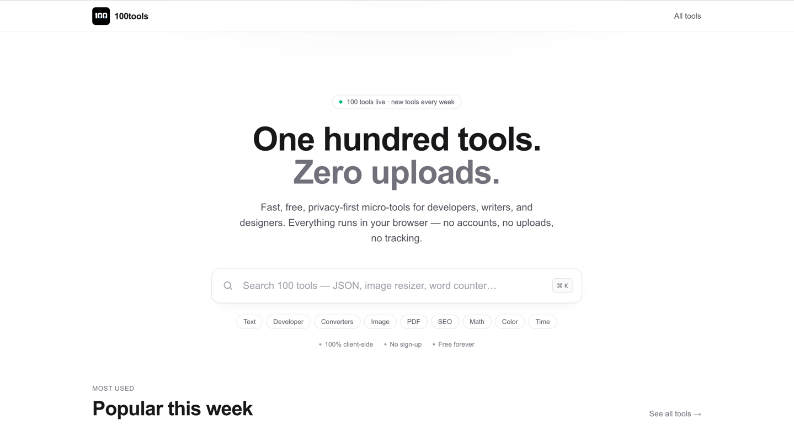
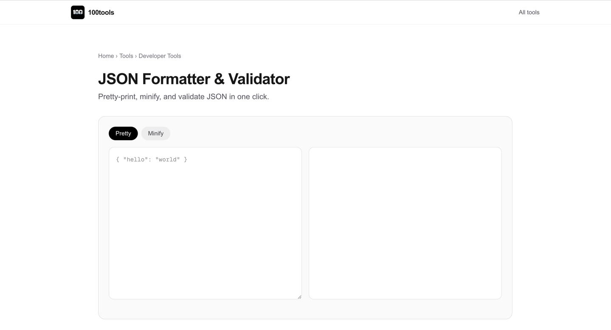
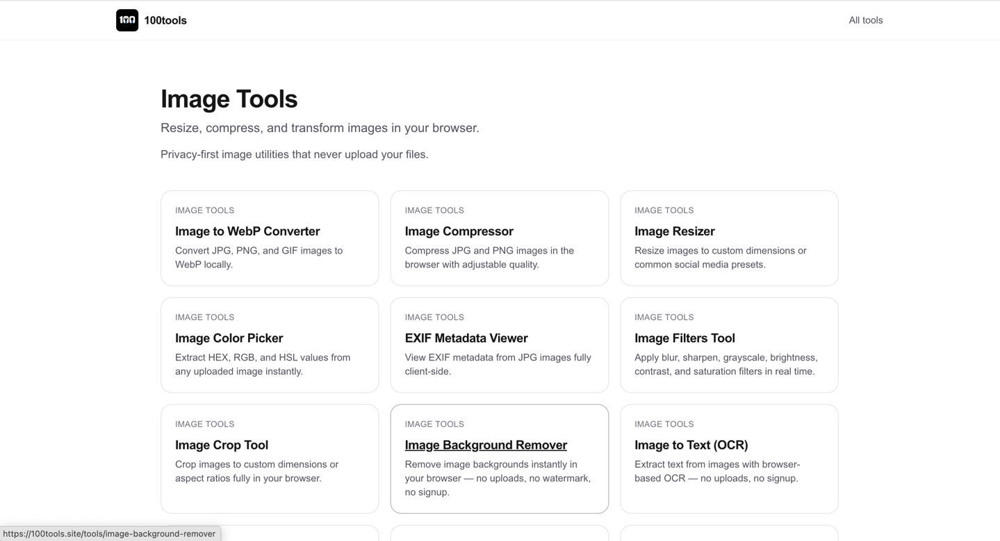

# 100tools

### 100 free, privacy-first online tools — no uploads, no accounts, no tracking.

**[Visit 100tools.site →](https://100tools.site)**

---

## What is 100tools?

**100tools** is a curated collection of **100 fast, free, privacy-first online utilities** for developers, writers, designers, marketers, and everyday users. Every tool runs entirely in your browser — your text, files, and images never leave your device.

No sign-ups. No paywalls. No uploads. No tracking pixels. Just tools.

> _A JSON formatter, a word counter, an image resizer, a PDF merger — all one click away, all instant, all private._

🌐 **Live site:** **[100tools.site](https://100tools.site)**

---

## Why 100tools?

| Feature | What it means for you |
|---|---|
| 🔒 **Privacy by default** | Tools run client-side in your browser. Your data never reaches a server. |
| ⚡ **Instant** | Pages are statically prerendered. Sub-second loads, even on mobile. |
| 🎁 **Free, forever** | No usage caps, watermarks, or feature gates. |
| 🚫 **No accounts** | Open a tool, use it, leave. Nothing to sign up for. |
| 📱 **Works offline** | Once a tool loads, most keep working without a connection. |
| 🌓 **Dark mode** | Automatic, respects your OS preference. |

---

## Tool categories

Browse all **[100 tools →](https://100tools.site/tools)** or jump into a category:

| Category | Count | Examples |
|---|---|---|
| 🖼️ **[Image tools](https://100tools.site/category/image)** | 25 | Resizer, compressor, background remover, HEIC → JPG, EXIF viewer |
| 💻 **[Developer tools](https://100tools.site/category/developer)** | 25 | JSON formatter, regex tester, JWT decoder, Base64, UUID, cron generator |
| 📝 **[Text tools](https://100tools.site/category/text)** | 21 | Word counter, case converter, text diff, lorem ipsum, slug converter |
| 📄 **[PDF tools](https://100tools.site/category/pdf)** | 9 | Merger, splitter, compressor, PDF → Word, password remover |
| 🔄 **[Converters](https://100tools.site/category/converter)** | 8 | CSV ↔ JSON, image → text (OCR), markdown → HTML, image → SVG |
| 🔍 **[SEO tools](https://100tools.site/category/seo)** | 7 | Meta tag generator, Open Graph preview, keyword density, robots.txt |
| 🎨 **[Color tools](https://100tools.site/category/color)** | 3 | Palette generator, contrast checker, gradient builder |
| ⏰ **[Time tools](https://100tools.site/category/time)** | 1 | Timezone converter |
| 🧮 **[Math tools](https://100tools.site/category/math)** | 1 | Random number generator |

A full sitemap is published at **[100tools.site/sitemap.xml](https://100tools.site/sitemap.xml)**.

---

## Popular tools

A few of the most-used utilities:

- **[JSON Formatter](https://100tools.site/tools/json-formatter)** — pretty-print, validate, and minify JSON
- **[Word Counter](https://100tools.site/tools/word-counter)** — words, characters, sentences, reading time
- **[Image Resizer](https://100tools.site/tools/image-resizer)** — resize images by pixels, percent, or preset
- **[PDF to Word](https://100tools.site/tools/pdf-to-word)** — extract editable text from PDFs
- **[QR Code Generator](https://100tools.site/tools/qr-code-generator)** — high-resolution QR codes with logo support
- **[Regex Tester](https://100tools.site/tools/regex-tester)** — test patterns with live highlighting
- **[Case Converter](https://100tools.site/tools/case-converter)** — UPPER, lower, Title, snake, kebab, camel
- **[Image Compressor](https://100tools.site/tools/image-compressor)** — shrink JPG/PNG/WebP without losing quality
- **[Base64 Encoder/Decoder](https://100tools.site/tools/base64)** — instant, two-way conversion
- **[JWT Decoder](https://100tools.site/tools/jwt-decoder)** — decode and inspect JSON Web Tokens locally

---

## Screenshots

<!-- Drop screenshot files in /screenshots and update the links below. -->

| Homepage | Tool page | Category page |
|---|---|---|
|  |  |  |

---

## Use cases

100tools is used daily by:

- **Developers** — formatting JSON, decoding JWTs, testing regex, generating UUIDs and cron expressions
- **Writers & students** — counting words, checking readability, converting Markdown, removing duplicates
- **Designers** — picking colors, building palettes, checking contrast, generating gradients
- **Marketers & SEOs** — previewing meta tags, generating Open Graph cards, checking keyword density
- **Photographers** — converting HEIC to JPG, removing EXIF, compressing images, generating favicons
- **Anyone with a PDF** — merging, splitting, compressing, or removing passwords without uploading

If you've ever Googled "convert X to Y online" and worried about uploading a private file — 100tools is built for you.

---

## Tech stack

100tools is a modern static web app:

- **Next.js (App Router)** — fully static site generation
- **React** + **TypeScript** (strict)
- **Tailwind CSS** — utility-first styling
- **Pure client-side processing** — no backend for user data
- **WOFF2 self-hosted fonts** — zero CLS, instant rendering
- **Statically prerendered** — every page is HTML at deploy time

The result: Lighthouse 100 on Accessibility, Best Practices, and SEO across the site.

---

## FAQ

#### Are these tools really free?
Yes — every tool is free with no usage limits, watermarks, or sign-up requirements. Small ads on tool pages keep the lights on; we never analyze what you type or paste.

#### Do you upload my files or text?
No. Tools are client-side by default and process everything locally in your browser. A handful that genuinely require a server (e.g. screenshot capture) are clearly labeled on their tool page.

#### Do I need an account?
No accounts, no email, no tracking pixels. Open a tool and use it.

#### Can I use results commercially?
Yes. Anything you create with these tools — formatted JSON, resized images, generated copy — is yours to use commercially with no attribution required.

#### Does it work offline?
After the first load, most tools continue to work without a connection because the heavy lifting happens in your browser.

#### How do I request a new tool?
Open an issue here on GitHub — see [Requesting a tool](#requesting-a-tool) below.

More questions answered in [FAQ.md](FAQ.md).

---

## Requesting a tool

The fastest way to get a new tool added:

1. **Search [existing issues](../../issues)** to see if it's already requested.
2. **Open a new issue** using the **Tool Request** template.
3. Describe:
   - What the tool should do (one sentence)
   - The category it belongs to
   - A typical input and the expected output
   - Any reference tools you've used before

We ship new tools every week and prioritise by 👍 reactions on issues.

---

## Roadmap

A rough sketch of what's next. See [ROADMAP.md](ROADMAP.md) for details.

- [x] First 100 tools shipped
- [ ] Tool pages with shareable input state (`?input=…`)
- [ ] Keyboard-first command palette across all tools
- [ ] Native install (PWA) with offline catalogue
- [ ] Localised tool pages (ES, FR, DE, PT, JA)
- [ ] Public API for select read-only tools (e.g. UUID, hash, slug)
- [ ] Browser extension for one-click tool access

---

## Contributing

100tools is run by a small team, but the **direction is community-driven**. The easiest, highest-leverage ways to contribute:

- ⭐ **Star the repo** — it helps others find the project
- 🐛 **Report a bug** — [open an issue](../../issues/new?template=bug-report.md)
- 💡 **Suggest a tool** — [open a request](../../issues/new?template=tool-request.md)
- ✍️ **Improve the docs** — typo fixes, FAQ additions, and use-case examples are all welcome
- 🌍 **Translate** — when localisation lands, native-speaker review of tool copy will be invaluable

See [CONTRIBUTING.md](CONTRIBUTING.md) for guidelines.

> **Source code:** The application source for 100tools is currently maintained in a private repository so we can ship updates quickly. This public repository hosts the **product docs, roadmap, issues, and community discussions**.

---

## Links

- 🌐 **Website:** [100tools.site](https://100tools.site)
- 🗂️ **All tools:** [100tools.site/tools](https://100tools.site/tools)
- 🐛 **Report issues:** [GitHub Issues](../../issues)
- 💬 **Discussions:** [GitHub Discussions](../../discussions)
- 🗺️ **Sitemap:** [100tools.site/sitemap.xml](https://100tools.site/sitemap.xml)

---

## License

The documentation, copy, and assets in this repository are released under the [MIT License](LICENSE). The 100tools application itself, hosted at [100tools.site](https://100tools.site), is a separate product.

---

**Built with care for people who care about privacy.**

[100tools.site](https://100tools.site) · [All tools](https://100tools.site/tools) · [Report an issue](../../issues)

